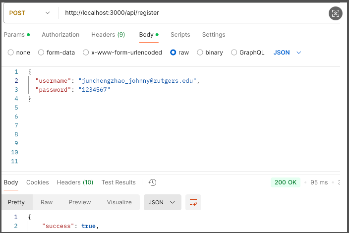
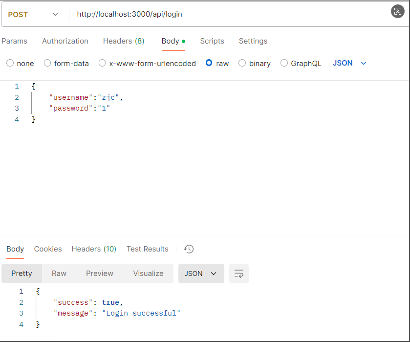
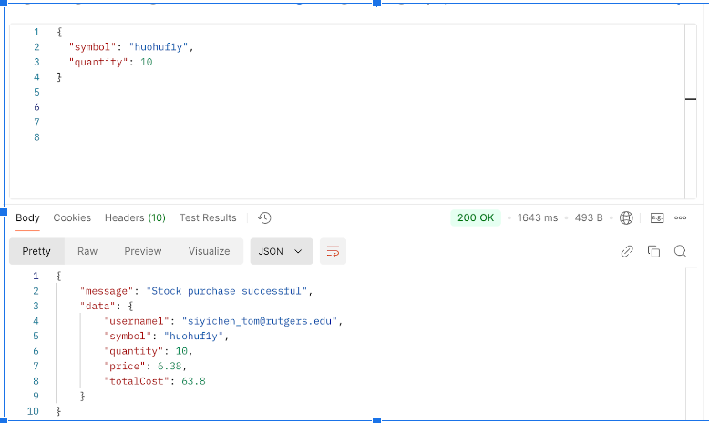
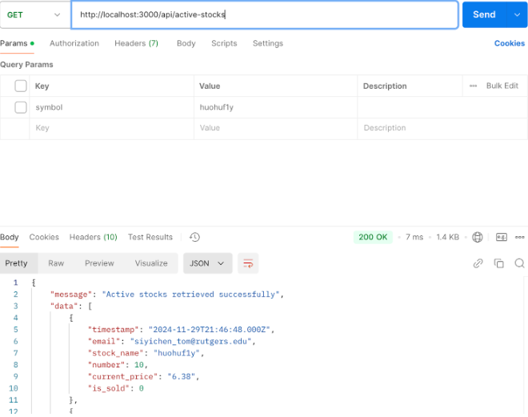
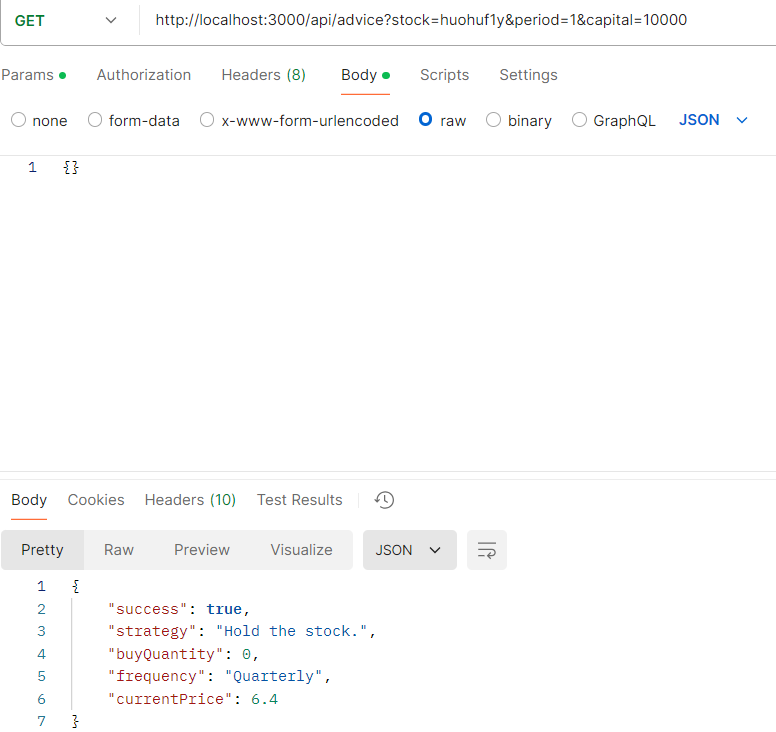
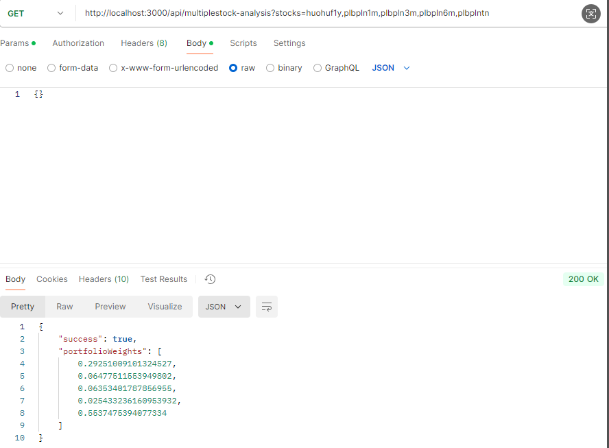

# Stock Analysis Web Application

This is a web application for stock analysis and portfolio management. The application provides features for single stock analysis, multiple stock comparison, and AI-powered investment advice.

## Prerequisites

Before running the application, make sure you have the following installed:

- Node.js (v14.0.0 or higher)
- npm (Node Package Manager)
- Postman (for testing backend code)
- MySQL Database (with MySQL Workbench)

## Project Structure

```
├── frontend/          # Frontend files
│   ├── js/            # JavaScript files
│   ├── *.html         # HTML pages
│   └── *.css          # CSS stylesheets
├── server/            # Backend server
│   ├── routes/        # API routes
│   ├── utils/         # Utility functions
│   └── middleware/    # Middleware functions
└── package.json       # Project dependencies
```

## Installation

1. Clone the repository:

```bash
git clone [repository-url]
cd [project-directory]
```

2. Install dependencies for the main project:

```bash
npm install
cd frontend
npm install
```

3. Install dependencies for the server:

```bash
cd server
npm install
```

4. For the ai agent folder

```bash
git clone https://github.com/dhh1995/PromptCoder
cd PromptCoder
pip install -e .
```

## Database Configuration

1. Create a database in MySQL
2. Configure the following variables in your database connection:

```env
host: '127.0.0.1',
user: 'root',
port: 3307,
password: '1234',
database: 'Stock_analysis_system'
```

## Running the Application

1. Start the backend server:

```bash
cd server
node server.js
```

The server will start running on `http://localhost:3000`

2. Start the frontend:

```bash
cd frontend
npx http-server -p 3001 --cors
```

The frontend will be available at `http://localhost:3001`

## Features

- User Authentication (Login/Register)
- Single Stock Analysis
- Multiple Stock Comparison
- Portfolio Management
- AI Investment Advice
- User Profile Management

## API Endpoints

### 1. User Management

#### Register User

**POST** `/register`

- Parameters
  - `username` (string)
  - `password` (string)

#### Login User

**POST** `/login`

- Parameters
  - `username` (string)
  - `password` (string)

### 2. Stock Trading and Portfolio Management

#### Buy Stock

**POST** `/buy-stock`

- Parameters
  - `symbol` (stock ticker, e.g., AAPL)
  - `quantity` (number of shares)

#### View Held Stocks

**GET** `/active-stocks`

- Logic
  - Retrieve the stocks that the user holds and has not sold
  - Format timestamps to local time

### 3. Investment Advice

#### Single Stock Investment Advice

**GET** `/advice`

- Parameters
  - `symbol` (stock ticker)
  - `period` (investment years, e.g., 3)
  - `capital` (initial money, e.g., 3000)

#### Portfolio Investment Advice

**GET** `/portfolio-recommendation`

- Parameters
  - `investmentYears` (investment years, e.g., 3)
  - `maxPortfolioSize` (maximum portfolio size, e.g., 5)

### 4. Analyze Multiple Stocks

**GET** `/multiplestock-analysis`

- Parameters
  - `stocks` (comma-separated stock tickers, e.g., huohuf1y,huohuf2m)

## Data Files

### output.csv

Stores historical stock price data

- Format: `<Date>,<Stock Symbol>,<Open Price>,<High Price>,<Low Price>,<Close Price>,<Volume>`

## Database Structure

### Users Table (`users`)

| Field    | Description     |
| -------- | --------------- |
| email    | User name       |
| password | Hashed Password |
| balance  | User Balance    |

### Transactions Table (`transactions`)

| Field         | Description                  |
| ------------- | ---------------------------- |
| email         | User name                    |
| symbol        | Stock Name                   |
| number        | Quantity the user has bought |
| current price | Current stock price          |
| is_sold       | Whether Sold                 |
| timestamp     | Transaction Timestamp        |

## Environment Variables

Create a `.env` file in the server directory with the following variables:

```
PORT=3000
MONGODB_URI=your_mongodb_connection_string
JWT_SECRET=your_jwt_secret
```

### API Keys Configuration

For the AI agent functionality, you need to configure the following API keys:

1. Create a `.env` file in the `ai-agent/PromptCoder2/Stockagent` directory with:

```
OPENAI_API_KEY=your_openai_api_key
ALPHA_VANTAGE_API_KEY=your_alpha_vantage_api_key
```

You can obtain these API keys from:

- OpenAI API Key: https://platform.openai.com/api-keys
- Alpha Vantage API Key: https://www.alphavantage.co/support/#api-key

Note: Make sure to keep your API keys secure and never commit them to version control.

## Contributing

1. Fork the repository
2. Create your feature branch (`git checkout -b feature/AmazingFeature`)
3. Commit your changes (`git commit -m 'Add some AmazingFeature'`)
4. Push to the branch (`git push origin feature/AmazingFeature`)
5. Open a Pull Request

## License

This project is licensed under the MIT License - see the LICENSE file for details.

## Contact

For any questions or concerns, please contact the development team.

---

## Environment Requirements

- Node.js
- postman(used to test the backend code)
- MySQL Database(workbench)

---

## Program Running Steps

1. **Install dependencies:**

   ```bash
   npm install
   cd frontend
   npm install
   ```

2. **Configure the database:**

   - Create a database in MySQL.

   - configure the following variables:

     ```env
     host: '127.0.0.1',
         user: 'root',
         port: 3307,
         password: 'YOUR PASSWORD',
         database: 'CONFIGURE WITH YOUR OWN DATABASE'
     ```

3. **Start the server(backend):**

   ```bash
   cd server
   node server.js
   ```

First, start the backend part. The backend server is running on the port 3000.

4. **Start the frontend:**

   cd frontend
   npx http-server -p 3001 --cors

Then start the frontend part. The service will run at `http://localhost:3001`.

5. **Run the ai agent part **
   cd ai-agent
   cd PromptCoder2
   cd Stockagent
   python app.py

---

## API Route Overview

### **1. User Management**

#### Register User

**POST** `/register`

- Parameters
  - `username` (string)
  - `password` (string)
- **postman test(input and return format)**:



#### Login User

**POST** `/login`

- Parameters
  - `username` (string)
  - `password` (string)
- **postman test(input and return format)**:



---

### **2. Stock Trading and Portfolio Management**

#### Buy Stock

**POST** `/buy-stock`

- Parameters
  - `symbol` (stock ticker, e.g., AAPL)
  - `quantity` (number of shares)
- Logic
  1. Retrieve user balance.
  2. Query real-time stock price.
  3. Calculate total cost and verify if balance is sufficient.
  4. Record the transaction and update the balance.
- **postman test(input and return format)**:



#### View Held Stocks

**GET** `/active-stocks`

- Logic
  - Retrieve the stocks that the user holds and has not sold.
  - Format timestamps to local time.
- **postman test(input and return format)**:



---

### **3. Investment Advice**

#### Single Stock Investment Advice

**GET** `/advice`

- Parameters
  - `symbol` (stock ticker)
  - `period` (investment years, e.g., 3)
  - `capital` (initial money, e.g., 3000)
- Logic：
  - Get single stock advice based on historical data and provide recommendations.
- **postman test(input and return format)**:



.

#### Portfolio Investment Advice

**GET** `/portfolio-recommendation`

- Parameters
  - `investmentYears` (investment years, e.g., 3)
  - `maxPortfolioSize` (maximum portfolio size, e.g., 5)
- Logic
  - Read data from the `output.csv` file.
  - Fill missing dates and calculate return rates for each stock.
  - Build a correlation matrix and select stocks based on investment years and correlation.
- **postman test(input and return format)**:.


---

### **4. Analyze Multiple Stocks**

**GET** `/multiplestock-analysis`

- Parameters
  - `stocks` (comma-separated stock tickers, e.g., huohuf1y,huohuf2m)
- Logic
  - return portfolilo weights for each stocks.
- **postman test(input and return format)**:.



---
